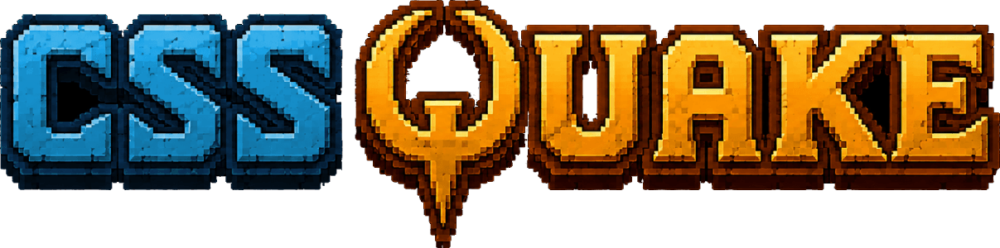

# cssQuake



Quake levels, rendered as DOM. Powered by [PolyCSS](https://github.com/LayoutitStudio/polycss).

cssQuake is a standalone browser renderer for Quake 1.06 shareware maps. It preprocesses the original game data into browser-ready JSON and image assets, then renders playable levels as inspectable HTML/CSS instead of WebGL or canvas.

## Includes

- Quake maps `e1m1` through `e1m8`.
- BSP, WAD, MDL, LMP, HUD, menu, pickup, and weapon preprocessing.
- First-person runtime systems for collision, doors, pickups, hazards, HUD, weapon feedback, and level transitions.
- Chrome trace tooling for measuring browser frame work.

## Architecture

cssQuake is built around [PolyCSS](https://github.com/LayoutitStudio/polycss), the DOM rendering layer that turns Quake geometry into real HTML elements. World faces are positioned with CSS `matrix3d(...)` transforms, textured with pixelated CSS backgrounds, and grouped into PolyCSS meshes instead of being drawn with WebGL or canvas.

The preparation step exists to make Quake data cheap for PolyCSS to mount. `scripts/prepare-quake.mjs` downloads the Quake 1.06 shareware archive from `QUAKE_SHAREWARE_URL`, verifies the extracted `resource.1`, extracts `ID1/PAK0.PAK`, parses the original BSP, WAD, MDL, LMP, entity, visibility, collision, HUD, menu, pickup, and weapon data, then writes browser-ready assets under `build/generated/public/local/quake`.

Textures are decoded through the Quake palette into generated PNG assets, animated texture sequences become CSS animation inputs, and episode maps get prebuilt PolyCSS render bundles. Those bundles let the browser attach the prepared world DOM directly instead of rebuilding every surface at startup.

At runtime, `src/quake/QuakeApp.ts` loads the prepared map JSON and mounts it into a PolyCSS scene. cssQuake keeps Quake metadata on the PolyCSS elements with attributes such as `data-quake-face`, `data-quake-model`, and `data-quake-entity`, so gameplay systems can connect DOM-rendered surfaces back to visibility, lightstyles, doors, buttons, brush-model movement, pickups, hazards, weapon feedback, HUD/menu state, and level transitions.

The browser does not parse the original PAK or BSP files while the game is running. Generated game assets are intentionally ignored by Git.

## Run

Requires Node 22 and pnpm.

```sh
pnpm install
export QUAKE_SHAREWARE_URL="<Quake 1.06 shareware zip URL>"
pnpm prepare:quake
pnpm dev
```

Open the Vite URL, usually `http://127.0.0.1:5173/`.

If `build/generated/public/local/quake` already exists locally, `pnpm dev` is enough.

## Build

```sh
export QUAKE_SHAREWARE_URL="<Quake 1.06 shareware zip URL>"
pnpm build
```

The `prebuild` step installs Playwright's Chromium binary for render bundle generation. The build then runs TypeScript typechecking, downloads and verifies the Quake shareware data, generates deploy assets under `build/generated/public/local/quake`, and runs `vite build`.

## Deploy

Netlify can build this repo directly from Git. Configure the site in the
Netlify UI with:

```text
Build command: pnpm build
Publish directory: dist
Node version: 22
```

Set `QUAKE_SHAREWARE_URL` in the Netlify environment to a Quake 1.06 shareware zip URL.

## Trace

With the dev server running at `http://127.0.0.1:5173/`:

```sh
pnpm trace:quake
```

Trace summaries and raw Chrome traces are written under ignored `bench/` paths.

## License

cssQuake source code is GPL-2.0.

Quake game data is separate. The build downloads unmodified Quake 1.06 shareware data and uses it to generate ignored assets under `build/generated/public/local/quake`; it is not covered by this repository's GPL license.

Quake and original game assets are copyright id Software LLC / Microsoft. This project is unaffiliated with id Software or Microsoft.
