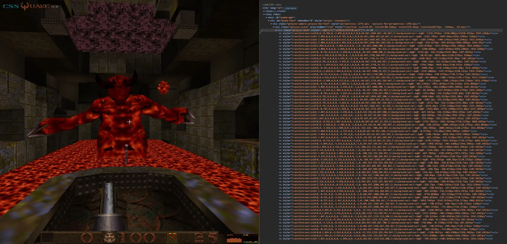

# cssQuake 👹

A port of id Software's [Quake](https://github.com/id-software/quake) that uses the [PolyCSS](https://github.com/LayoutitStudio/polycss) engine instead of webGL. cssQuake preprocesses the original data into browser-ready JSON and image assets, then renders the game as real HTML/CSS 3D geometry. 

Play the live version: [cssquake.com](https://cssquake.com) 🕹️



## How to Run

Install dependencies and generate the Quake assets once:

```sh
pnpm install
export QUAKE_SHAREWARE_URL="<Quake 1.06 shareware zip URL>"
pnpm prepare:quake
```

After the assets exist, run the local dev server or build the app:

```sh
pnpm dev
pnpm build
```

`pnpm build` only builds the Vite app. Use `pnpm build:full` when you intentionally want to regenerate Quake assets and build the app in one command.

For focused asset iteration, use `pnpm prepare:quake:map e1m7` or `pnpm prepare:quake:model dog`.

## How It Works

cssQuake is built around the [PolyCSS](https://github.com/LayoutitStudio/polycss) 3D DOM rendering engine. This turns Quake geometry into real HTML elements: world faces are positioned with CSS `matrix3d(...)` transforms, textured with pixelated CSS backgrounds, and grouped into meshes instead of being drawn on a `<canvas>`.

`src/App.ts` loads generated map/model JSON from `/q` and mounts prebuilt PolyCSS render bundles. Gameplay systems connect rendered surfaces back to visibility, lightstyles, doors, buttons, brush-model movement, pickups, hazards, weapon feedback, HUD/menu state, and level transitions.

The browser does not parse the original PAK or BSP files while the game is running. Generated game assets are intentionally ignored by Git.

## Asset Pipeline

`src/prepare/assets.mjs` downloads the Quake 1.06 shareware archive from `QUAKE_SHAREWARE_URL`, verifies the extracted `resource.1`, extracts `ID1/PAK0.PAK`, parses the original BSP, WAD, MDL, LMP, entity, visibility, collision, HUD, menu, pickup, and weapon data, then writes browser-ready assets under the `build/generated/public/q` folder.

Textures are decoded through the Quake palette into generated PNG assets, animated texture sequences become CSS animation inputs, and episode maps get prebuilt PolyCSS render bundles. Those bundles let the browser attach the prepared world DOM directly instead of rebuilding every surface at startup.

## Embedding

cssQuake can run inside an iframe. Add `relayKeys=1` only if the parent page wants filtered gameplay key events from the focused game iframe:

```html
<iframe
  src="https://cssquake.com/?relayKeys=1"
  allow="pointer-lock; fullscreen"
  referrerpolicy="origin"
></iframe>
```

When enabled, cssQuake posts `cssquake:key` messages for gameplay keys only. Parent pages should validate `event.origin` before reading them. Using `referrerpolicy="no-referrer"` disables the relay because cssQuake will not have a parent origin to target.

## URL API

cssQuake keeps its shareable game state in small, Quake-native URL parameters. `map=e1m1` opens a map directly, and `view=x,y,z,pitch,yaw,roll` places the player at a Quake-style pose: origin in Quake units, with pitch, yaw, and roll in degrees.

```text
https://cssquake.com/?map=e1m1&view=480,-192,72,0,90,0
```

This makes a URL behave like a lightweight console command for reproducing bugs, sharing exact views, capturing screenshots, and comparing cssQuake against native Quake tools such as vkQuake. Roll must currently be zero because cssQuake does not render camera roll yet.

Developer-oriented params such as `debugPolys=1`, `debugFly=1`, `debugPointer=1`, `perspective=...`, and `zoom=...` are kept separate from the core route so debug sessions can be reproduced without turning the URL API into a save system.
