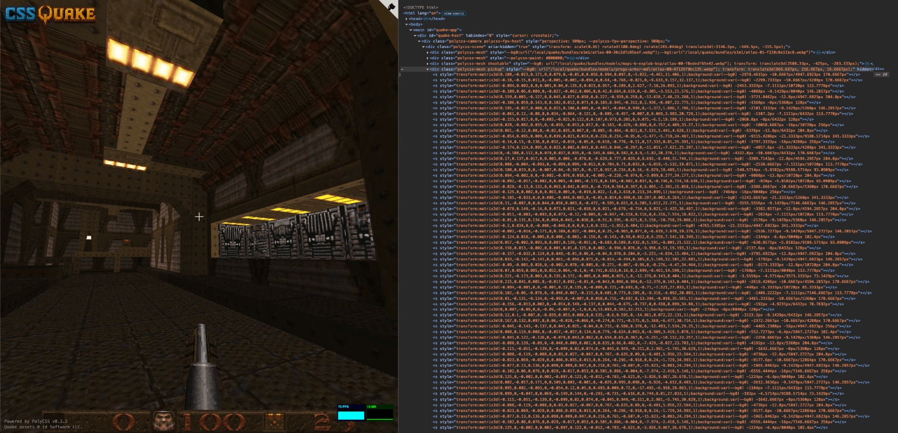

# cssQuake

Turns [Quake](https://github.com/id-software/quake) into playable, inspectable HTML/CSS. cssQuake preprocesses the original game data into browser-ready JSON and image assets, then renders each level as real DOM geometry powered by [PolyCSS](https://github.com/LayoutitStudio/polycss) instead of WebGL. 

Try the live version: [cssquake.wtf](https://cssquake.wtf) 🕹️



## How to Run

Install dependencies and build the generated Quake assets:

```sh
pnpm install
export QUAKE_SHAREWARE_URL="<Quake 1.06 shareware zip URL>"
pnpm build
```

After the build succeeds, run the local dev server:

```sh
pnpm dev
```

If `build/generated/public/q` already exists locally, you can skip `pnpm build` and run `pnpm dev` directly.

## How It Works

cssQuake is built around the [PolyCSS](https://github.com/LayoutitStudio/polycss) 3D DOM rendering layer. This turns Quake geometry into real HTML elements: world faces are positioned with CSS `matrix3d(...)` transforms, textured with pixelated CSS backgrounds, and grouped into meshes instead of being drawn on a `<canvas>`.

`src/App.ts` loads the prepared map JSON and mounts it into a PolyCSS scene. Quake metadata is kept on the elements with attributes such as `data-quake-face`, `data-quake-model`, and `data-quake-entity`, so gameplay systems can connect DOM-rendered surfaces back to visibility, lightstyles, doors, buttons, brush-model movement, pickups, hazards, weapon feedback, HUD/menu state, and level transitions.

The browser does not parse the original PAK or BSP files while the game is running. Generated game assets are intentionally ignored by Git.

## Asset Pipeline

`src/prepare/assets.mjs` downloads the Quake 1.06 shareware archive from `QUAKE_SHAREWARE_URL`, verifies the extracted `resource.1`, extracts `ID1/PAK0.PAK`, parses the original BSP, WAD, MDL, LMP, entity, visibility, collision, HUD, menu, pickup, and weapon data, then writes browser-ready assets under the `build/generated/public/q` folder.

Textures are decoded through the Quake palette into generated PNG assets, animated texture sequences become CSS animation inputs, and episode maps get prebuilt PolyCSS render bundles. Those bundles let the browser attach the prepared world DOM directly instead of rebuilding every surface at startup.

